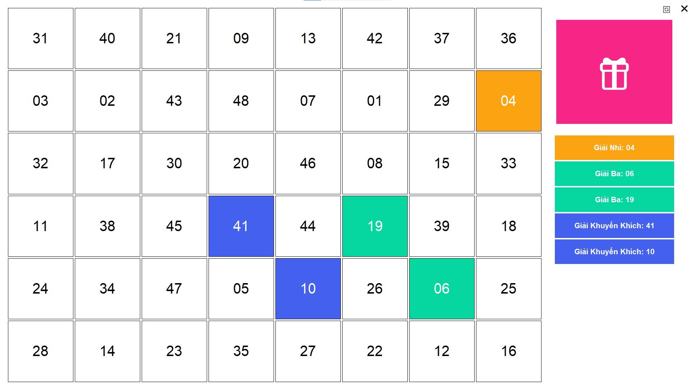

# 🎲 LuckyDraw

> **Ứng dụng quay số may mắn hiện đại** với giao diện đồ họa đẹp mắt, hỗ trợ tùy chỉnh giải thưởng, hiệu ứng âm thanh và lưu trữ kết quả. Hoàn hảo cho các sự kiện, bốc thăm trúng thưởng, hay bất kỳ hoạt động nào cần chọn ngẫu nhiên người thắng giải.

<div align="center">
  
  <p><em>Giao diện chính của ứng dụng LuckyDraw</em></p>
</div>


---

## ✨ Tính năng chính

- 🎨 **Giao diện hiện đại**: Fullscreen UI với PySide6, responsive và thân thiện
- 🏆 **Quản lý giải thưởng**: Tùy chỉnh tên, số lượng, màu sắc một cách trực quan
- 🎵 **Hiệu ứng âm thanh**: Nhạc nền khi quay và âm thanh thông báo khi trúng giải
- ✨ **Hiệu ứng động**: Animation mượt mà khi quay số và công bố kết quả
- 💾 **Lưu trữ lịch sử**: Tự động lưu kết quả, có thể xem lại và quản lý
- ⚙️ **Cấu hình linh hoạt**: Giao diện cấu hình trực quan hoặc chỉnh sửa file JSON

## 🛠️ Yêu cầu hệ thống

- **Python**: 3.8 hoặc cao hơn
- **Hệ điều hành**: Windows, macOS, Linux
- **Thư viện**: PySide6, pygame

## 📥 Cài đặt

### 1. Clone repository
```bash
git clone https://github.com/caophuocdanh/luckydraw-py.git
cd luckydraw-py
```

### 2. Cài đặt dependencies
```bash
pip install PySide6 pygame
```

### 3. Chạy ứng dụng
```bash
python main.py
```

## 📁 Cấu trúc dự án

```
LuckyDraw-py/
├── main.py                  # 🚀 Mã nguồn chính
├── config.json             # ⚙️ Cấu hình ứng dụng
├── results.json            # 📊 Lưu kết quả quay số
├── build.cmd               # 🔨 Script build executable
├── luckydraw.ico           # 🎨 Icon ứng dụng
├── luckydraw.jpg           # 🖼️ Hình ảnh demo
├── icon.md                 # 📝 Danh sách Unicode icons
├── assets/                 # 🎵 Tài nguyên âm thanh
│   ├── background_music.mp3
│   └── win_sound.mp3
└── README.md               # 📖 Tài liệu hướng dẫn
```

## 🎮 Hướng dẫn sử dụng

### Bước 1: Cấu hình ban đầu
- Mở ứng dụng và nhấn nút **⚙️ Cấu hình**
- Thiết lập số lượng người tham gia
- Thêm/chỉnh sửa các giải thưởng theo ý muốn
- Bật/tắt nhạc nền và âm thanh

### Bước 2: Bắt đầu quay số
- Nhấn nút **🎲 Quay số** để bắt đầu
- Hệ thống sẽ hiển thị hiệu ứng quay số
- Kết quả sẽ được công bố và tự động lưu

### Bước 3: Quản lý kết quả
- Xem lịch sử kết quả đã quay
- Reset kết quả để quay lại từ đầu
- Xóa toàn bộ dữ liệu nếu cần

## ⚙️ Cấu hình chi tiết
### File `config.json`

```json
{
  "settings": {
    "title": "Lucky Draw",
    "total_numbers": 56,
    "draw_duration_seconds": 5,
    "music": false,
    "music_duration": 20,
    "background_music_path": "assets\\background_music.mp3",
    "win_sound_path": "assets\\win_sound.mp3"
  },
  "prizes": [
    {
      "id": 1,
      "name": "Giải Nhất",
      "count": 1,
      "color": "#f72585"
    },
    {
      "id": 2,
      "name": "Giải Nhì", 
      "count": 2,
      "color": "#fca311"
    },
    {
      "id": 3,
      "name": "Giải Ba",
      "count": 3,
      "color": "#06d6a0"
    }
  ]
}
```

### Giải thích các tham số

#### Phần `settings`:
| Tham số | Kiểu | Mô tả |
|---------|------|-------|
| `title` | string | Tiêu đề hiển thị trên cửa sổ ứng dụng |
| `total_numbers` | integer | Tổng số người tham gia (1-999) |
| `draw_duration_seconds` | integer | Thời gian hiệu ứng quay số (giây) |
| `music` | boolean | Bật/tắt nhạc nền (`true`/`false`) |
| `music_duration` | integer | Thời gian phát nhạc nền mỗi lần quay |
| `background_music_path` | string | Đường dẫn file nhạc nền |
| `win_sound_path` | string | Đường dẫn file âm thanh thắng giải |

#### Phần `prizes`:
| Tham số | Kiểu | Mô tả |
|---------|------|-------|
| `id` | integer | Mã định danh duy nhất cho giải thưởng |
| `name` | string | Tên giải thưởng hiển thị |
| `count` | integer | Số lượng giải thưởng loại này |
| `color` | string | Mã màu hex để hiển thị (#RRGGBB) |

## 🎨 Giao diện và Controls

### Màn hình chính
- **🎲 Nút quay số**: Bắt đầu quá trình quay số may mắn
- **⚙️ Cấu hình**: Mở cửa sổ thiết lập chi tiết
- **🔄 Reset**: Đặt lại tất cả kết quả về trạng thái ban đầu
- **🗑️ Xóa**: Xóa toàn bộ lịch sử kết quả
- **❌ Thoát**: Đóng ứng dụng

### Cửa sổ cấu hình
- **Cài đặt chung**: Số người tham gia, thời gian quay, âm thanh
- **Quản lý giải thưởng**: Thêm/sửa/xóa giải thưởng, đổi màu
- **Lưu cài đặt**: Áp dụng thay đổi và quay lại màn hình chính

## 🔧 Build thành file EXE

Sử dụng script `build.cmd` có sẵn để tạo file executable:

```bash
build.cmd
```

Hoặc chạy lệnh PyInstaller thủ công:

```bash
pyinstaller --onefile --windowed --icon=luckydraw.ico --add-data "assets;assets" --add-data "config.json;." main.py
```

### 📦 Cấu trúc sau khi build

Sau khi build thành công, bạn sẽ có cấu trúc thư mục như sau:

```
dist/
├── Lucky Draw.exe          # 🚀 File executable chính (standalone)
├── config.json            # ⚙️ File cấu hình (tự động khởi tạo nếu chưa có)
├── results.json           # 📊 File kết quả (tự động khởi tạo khi quay số)
└── assets/                # 🎵 Thư mục âm thanh (tùy chọn)
    ├── background_music.mp3   # Nhạc nền
    └── win_sound.mp3         # Âm thanh thắng giải
```

#### 📋 Hướng dẫn triển khai
1. **Copy toàn bộ thư mục `dist/`** tới máy tính đích
2. **Chạy `Lucky Draw.exe`** để khởi động ứng dụng
3. **Không cần cài đặt Python** hay thư viện bổ sung trên máy đích
4. **Thư mục `assets/`** có thể bỏ qua nếu không cần âm thanh

#### ⚠️ Lưu ý quan trọng
- File `.exe` đã bao gồm tất cả dependencies cần thiết
- Thư mục `assets/` chứa file âm thanh (không có vẫn hoạt động được)
- File `config.json` tự động khởi tạo nếu chưa có
- File `results.json` sẽ tự động khởi tạo và cập nhật khi có kết quả quay số mới
- Kích thước toàn bộ package khoảng 80-100MB do bao gồm Python runtime
- Có thể chạy trực tiếp trên Windows mà không cần cài đặt thêm gì

## 📁 Quản lý files

### Files tự động tạo
- `config.json`: Tự động khởi tạo với cài đặt mặc định nếu chưa có
- `results.json`: Tự động tạo và cập nhật khi có kết quả quay số mới
- Backup files: Hệ thống có thể tạo backup tự động

### Files có thể tùy chỉnh  
- `config.json`: Cấu hình chính, có thể chỉnh sửa bằng text editor
- `assets/`: Thư mục chứa file âm thanh, có thể thay thế bằng file khác hoặc bỏ qua


### Debug mode
Chạy với tham số debug để xem thông tin chi tiết:
```bash
python main.py --debug
```

## 🤝 Đóng góp

Chúng tôi hoan nghênh mọi đóng góp! Vui lòng:

1. **Fork** repository này
2. Tạo **feature branch** (`git checkout -b feature/AmazingFeature`)  
3. **Commit** thay đổi (`git commit -m 'Add some AmazingFeature'`)
4. **Push** lên branch (`git push origin feature/AmazingFeature`)
5. Mở **Pull Request**

### Ý tưởng tính năng mới
- [ ] Export kết quả ra Excel/PDF
- [ ] Import danh sách người tham gia từ file
- [ ] Thêm nhiều theme giao diện
- [ ] Hỗ trợ quay số theo nhóm
- [ ] Tích hợp database cho sự kiện lớn

## 📄 License

Dự án được phân phối dưới giấy phép MIT. Xem file `LICENSE` để biết thêm chi tiết.

## 👨‍💻 Tác giả

- **GitHub Copilot** - *AI Assistant* 
- **Your Name** - *Cao Phước Danh* - [GitHub Profile](https://github.com/caophuodanh)

## 🙏 Lời cảm ơn

- [PySide6](https://doc.qt.io/qtforpython/) - Framework GUI mạnh mẽ
- [Pygame](https://www.pygame.org/) - Thư viện xử lý âm thanh
- [PyInstaller](https://pyinstaller.org/) - Công cụ build executable

---

<div align="center">

**⭐ Nếu dự án này hữu ích, hãy star cho chúng tôi! ⭐**

Made with ❤️ by GitHub Copilot and AI Studio 

</div>
